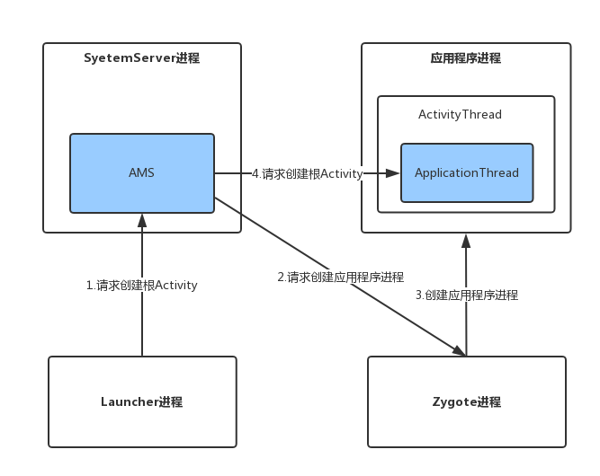
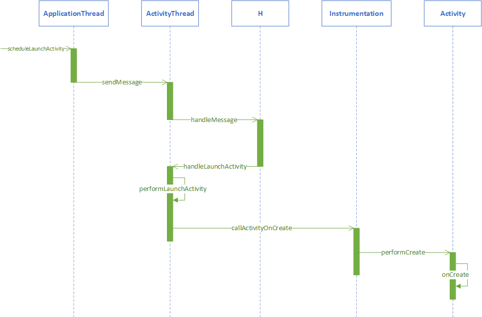

# Activity启动过程

## **根Activity启动过程中涉及的进程**

## 四个进程调用的时序图

## **Launcher请求AMS过程**

## **AMS调用APP过程**

## AMS和APP通讯

## **APP进程中ActivityThread启动Activity的过程**


[Android深入四大组件（六）Android8.0 根Activity启动过程（前篇）](https://liuwangshu.cn/framework/component/6-activity-start-1.html)

[Android深入四大组件（七）Android8.0 根Activity启动过程（后篇）](https://liuwangshu.cn/framework/component/7-activity-start-2.html)


