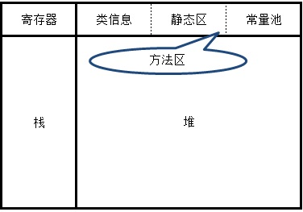
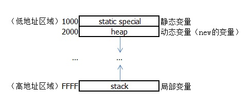
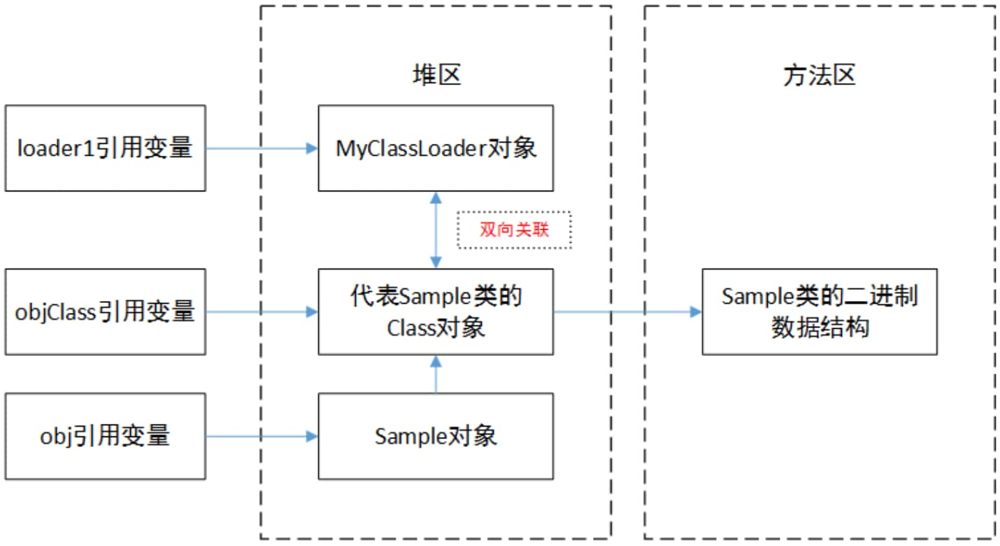
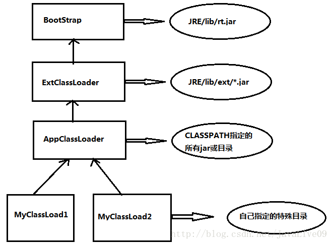

# Java3

## JVM虚拟机

### java内存模型

#### 逻辑模型

**方法区**

存放类信息、常量池、静态数据

#### 堆

存放new出的对象 成员变量存放在堆中

#### 栈

局部变量存放在栈中 Java中的栈：每当启动一个线程时JVM就为他分配一个java栈，栈是以帧为单位保存当前线程的运行状态。每当调用一个java方法时，JVM会在该线程对应的栈中压入一个帧。执行这个方法时，它使用这个帧来存储参数、局部变量、this等信息。方法执行完栈中会弹出帧。数据结构中的栈：当需要回溯操作时会用栈。路径回溯、操作回溯。

#### 寄存器

用于计算寻址。 



#### 物理模型



### java虚拟机与程序的生命周期

Java程序是寄生在虚拟机上的。一个应用程序对应一个虚拟机。它们的生命周期是一致的。

#### 开始

程序开始运行。

#### 结束

* 程序正常运行结束。
* 程序中执行了System.exit\(0\)。
* 程序中出现异常。
* 操作系统错误。

### java类的加载

#### java类的加载时机

Java程序使用类的时候会引起类的加载。只有首次主动方式使用类时，才会对类进行初始化。

**主动方式**

只有当程序访问的静态变量或静态方法定义在当前类或当前接口时，才可以认为是主动使用。调用classloader加载一个类，不是对类的主动使用，不会导致类的初始化。

* new对象的时候。
* 访问类（接口）的静态变量或给它赋值的时候。
* 调用类的静态方法。
* 反射  Class.forName\("xxx.xxx.xxx"\)。
* 初始化一个类的子类。
* 启动类（main方法所在的类）。

**被动方式**

除了6种主动加载方式以外都是被动方式，如：虚拟机预加载。

### java类的加载过程

#### 加载

将类的.class二进制文件读入到方法区内。 然后在堆区创建一个java.lang.Class对象（Class对象构造器是私有的，只有虚拟机才能实例化它），封装方法区内对应的数据结构。加载.class的方式

* 本地.class文件。
* 网络下载的.class文件。 通过java.NET.URLClassloader类来使用
* jar,zip包中的.class文件。
* 专有数据库中提取.class文件。

#### 连接

* 验证：确保类被加载的正确性。
* 准备：为类的静态变量在方法区里分配内存，赋上默认值。
* 解析：把符号引用转换为直接引用。

#### 初始化

为类的变量赋予类中的初始化值。

### java类的卸载

#### 自带类加载器加载的类

由Java虚拟机自带的类加载器所加载的类，在虚拟机的生命周期中，始终不会被卸载。

Java虚拟机自带的类加载器包括根类加载器、扩展类加载器和系统类加载器。

Java虚拟机本身会始终引用这些类加载器，而这些类加载器则会始终引用它们所加载的类的Class对象，因此这些Class对象始终是可触及的。

**自定义的类加载器加载的类**



如果程序运行过程中，将上图左侧三个引用变量都置为null，此时Sample对象结束生命周期，MyClassLoader对象结束生命周期，代表Sample类的Class对象也结束生命周期，Sample类在方法区内的二进制数据**被卸载**。

### java类加载器

#### 类型

**java虚拟机自带的类加载器**

**根类加载器（bootstrap）**

c++实现，加载jre核心包的类，如：jie/lib/rt.jar 中的类，Java.lang.Object ，java.lang.String等。

**扩展类加载器（extension）**

java实现，父加载器是根加载器。加载jre中扩展包的类，如：jre/lib/ext/dnsns.jar中的类。

**系统类加载器（system）**

java实现，父加载器是扩展类加载器。从环境变量classpath指定的目录中加载类。是抽象类java.lang.ClassLoader的子类。

**用户自定义的类加载器**

java实现，父加载器是系统类加载器。

#### 加载过程

加载时采用的是父委托机制。（是逻辑上的parent关系，通过包含一个父加载器引用作为属性的方式实现。而不是继承上的关系） 总是先用父加载器加载类，层层传递直到根加载器。如果父加载器加载不了，就用当前层的加载器加载。 如果全都不能加载，则抛出ClassNotFoundException异常。 在类加载器的内部实现中，用一个Java集合来存放所加载类的引用。



#### 加载器和Class对象：

在类加载器的内部实现中，用一个Java集合来存放所加载类的引用。

另一方面，一个Class对象总是会引用它的类加载器。调用Class对象的getClassLoader\(\)方法，就能获得它的类加载器。

由此可见，Class实例和加载它的加载器之间为双向关联关系。

### java多线程内存模型

#### 主存

对应堆区，方法区（Java虚拟机规范把方法区描述为堆的一个逻辑部分，叫non-heap非堆，与堆区分开）。 主存中的内容是线程共享。全局变量，静态变量，常量是线程共享的。

#### 线程间交互

* 不同线程间也无法直接访问彼此的工作内存的变量。
* 线程的对变量的所有操作（读取，赋值）都必须在工作内存中进行。而不能直接操作主存中的变量。

线程使用主存的方法是，在工作内存中保存一份要使用到的主存中的变量的字段。线程间变量值的传递通过主存来完成。 线程A修改一个变量的值，然后向主内存进行回写，另外一条线程B在线程A回写完之后再从主内存进行读取操作，新值传递到了B线程。

#### 线程工作内存

对应栈区。 栈区中的内容是线程私有的。局部变量，参数变量是线程私有的。

### 引用类型

#### 强引用 StrongReference

某个对象只有强引用时，它就永远不会被回收。

#### 软引用 SoftReference

某个对象只有软引用时，当内存不够时，会回收这个对象。如果内存仍然不够则抛出内存溢出异常。

#### 弱引用 WeakReference

某个对象只有弱引用时，当gc线程回收的时候，它一定会被回收。

#### 虚引用 PhantomReference

配合ReferenceQueue可以让我们准确地知道对象何时被从内存中删除。 注: 虚引用在回收前会将对象放入引用队列，其他引用是回收后放入。 [codebag demo](https://github.com/javalive09/CodeBag/blob/master/sample/src/main/java/com/javalive09/sample/project/raventech/reference.java)

```text
    public class PhantomReferenceTest {
        public static void main(String... args){
            ReferenceQueue rq = new ReferenceQueue(); 
            A a = new A();
            a.s ="hello";
            Reference r = new PhantomReference(a, rq);
            a = null;
            System.gc();    

            new Thread(new Runnable() {
                public void run() {
                    while(Reference ref = rq.remove != null )  {
                        System.out.println(ref.get());
                    }
                }
            }).start();
        } 
    }
    class A{
        String s;
    }
```

#### ReferenceQueue的作用

SoftReference, WeakReference, PhantomReference 都可以在构造的时候加入ReferenceQueue参数。 当包装对象被gc的时候，对应的包装类reference会被放入ReferenceQueue中。通过检查ReferenceQueue是否为空来判断对象的回收。 例如 leakcanary中对对象是否回收的判断

```text
private void removeWeaklyReachableReferences() {
    KeyedWeakReference ref;
    while((ref = (KeyedWeakReference) queue.poll()) != null) {
        retainedKeys.remove(ref.key);
    }
}
```

### 垃圾回收

Java虚拟机启动后会启动一个gc线程，gc线程会不定时的进行垃圾回收工作。

#### 如何定义垃圾

**引用计数算法**

某个对象有一个引用，计数器加1；引用断开，计数器减1。 gc线程工作时发现引用计数器为0的对象就会回收它。


循环引用导致不可回收


**可达性分析算法**

如果发现没有被GC Root引用的对象就回收它。


可作为GC Root的对象包括以下几种： 

1. 虚拟机栈（栈帧中的本地变量表）中引用的对象 

2.方法区中类静态属性引用的对象 

3.方法区中常量引用的对象 

4.本地方法栈中 JNI（即一般说的 Native 方法）引用的对象


#### 怎么回收垃圾

堆空间 = 新生代\(1/3）+ 老年代\(2/3\) 

新生代 = eden\(8/10\) + survivor\(2/10\) survivor = from\(1/10\) + to\(1/10\)

eden：标记清除算法\(有内存碎片\) 

survivor：复制算法（高效，无碎片，占空间） 

老年代：标记整理算法（低效，stop the world）

Minor GC：发生在新生代     Major GC：发生在老年代


内存担保机制下，无法安置的对象会直接进到老年代 

1.大对象 【eden-&gt;老年代】

 2.长期存活对象 age&gt;15 【survivor-&gt;老年代】 Survivor 区中每经历一次 Minor GC，年龄就增加 1 岁。

 3.动态对象年龄 【survivor-&gt;老年代】 Survivor空间中相同年龄所有对象大小的总合大于 Survivor 空间的一半


## java多线程并发处理

### 多个线程处理完成触发一个事件如何设计

在项目需求中做同步的时候，有时候会有这种设计， 服务器端有统一的可配置的数据， 开启几个线程去服务器请求数据。线程任务完成后，将获取数据存入数据库。 用于界面展示。 每一个线程对应的数据库操作ok后，再发请求去服务端获取手机唯一id 对应的用户的自定义数据。 每一个线程都获取数据ok，触发一个事件。如弹出对话框，然后告诉用户服务端有数据，是否同步。 这种需求可以用事务处理的方法来做。

#### 多线程处理的事务的数目确定的情况下：

**变量计数法。**

一共n个线程。每完成一个线程任务，count++ ，当count == n 的时候，触发事件。

**容器计数法。**

每开始一个线程任务，容器中加入一个线程id， 每完成一个线程任务，容器中删除对应的线程id， 当容器为空 的时候，触发事件。

#### 多线程处理的事务的数目不确定的情况下：

守护线程遍历的办法： 每开始一个线程任务，AtomicLong mTaskCounter = new AtomicLong\(\); 计数加一。执行完成后计数减一。 当守护线程 mTaskCounter 为0 时， 不在阻塞。执行finish action。

```text
public void startScan(ArrayList<String> paths) {  
    try {  
        for (String path : paths) {  
            scanDir(path);//多线程执行  
        }  
        while (mTaskCounter.get() > 0) {  
            Thread.sleep(100);  
        }  

        //do finish action  
    } catch (Exception ex) {  
        ex.printStackTrace();  
    }  
}
```

### [多线程 扫描 文件 demo](https://github.com/javalive09/ScanSdCardDemo/tree/master/app/src/main/java/peter/util/scandemo)

## 反射

```text
public class Reflection {

    private int age = 1;
    private String name = "peter";

    private String show() {
        LogUtil.i( "show()");
        return "Reflection()";
    }

    private void show(int a) {
        LogUtil.i("show(" + a + ")");
    }

    private void show(int a, String str) {
        LogUtil.i( "show(" + a + ","+str + ")");
    }

    private void show(Test test) {
        LogUtil.i("show(" + test.toString() + ")");
    }

    static class Test{

        @Override
        public String toString() {
            return "custom class Test";
        }

    }

    public int getAge() {
        return age;
    }

    public String getName() {
        return name;
    }
}
```

### 获取私有属性值

```text
        try {
            Field field = Reflection.class.getDeclaredField("name");
            field.setAccessible(true);
            Object obj = field.get(new Reflection());
            LogUtil.i("obj=" + obj);
        } catch (Exception e) {
            e.printStackTrace();
        }
```

### 设置私有属性值

```text
        try {
            Field field = Reflection.class.getDeclaredField("age");
            field.setAccessible(true);
            field.set(new Reflection(), 100);
        } catch (Exception e) {
            e.printStackTrace();
        }
```

### 调用私有方法

#### 调用只包含基本类型参数的方法

基本类型都有自己的Class\(不是他们的包装类\), byte.class, short.class, long.class

```text
        try {
            Method method = Reflection.class.getDeclaredMethod("show",
                    new Class[] { int.class });
            method.setAccessible(true);
            method.invoke(new Reflection(), new Object[] { 1 });
        } catch (Exception e) {
            e.printStackTrace();
        }
```

#### 调用只包含引用类型参数的方法

```text
        try {
            Method method = Reflection.class.getDeclaredMethod("show",
                    new Class[] { Reflection.Test.class });
            method.setAccessible(true);
            method.invoke(new Reflection(), new Object[] { new Reflection.Test() });
        } catch (Exception e) {
            e.printStackTrace();
        }
```

#### 调用既包含基本类型又包含引用类型参数的方法

```text
        try {
            Method method = Reflection.class.getDeclaredMethod("show",
                    new Class[] { int.class, String.class });
            method.setAccessible(true);
            method.invoke(new Reflection(), new Object[] { 1, "string" });
        } catch (Exception e) {
            e.printStackTrace();
        }
```

#### 调用无参数的方法

```text
        try {
            Method method = Reflection.class.getDeclaredMethod("show");
            method.setAccessible(true);
            method.invoke(new Reflection());
        } catch (Exception e) {
            e.printStackTrace();
        }
```

### 获取方法返回值

```text
        try {
            Method method = Reflection.class.getDeclaredMethod("show");
            method.setAccessible(true);
            method.invoke(new Reflection());
        } catch (Exception e) {
            e.printStackTrace();
        }
```

## 动态代理

代理类在程序运行前不存在、运行时由程序动态生成的代理方式称为动态代理。 主要应用：1. 实现无侵入式的扩展方法功能（方法性能检测，日志管理）2.实例化接口（retrofit处理接口注解） Java 提供了动态代理的实现方式，可以在运行时刻由虚拟机动态生成代理类。这种代理方式的一大好处是可以方便对代理类的函数做统一或特殊处理，如记录所有函数执行时间、所有函数执行前添加验证判断、对某个特殊函数进行特殊操作，而不用像静态代理方式那样需要新建代理类并修改函数内容。[虚拟机内部动态new代理类的原理](http://blog.csdn.net/zhangerqing/article/details/42504281)。 实现动态代理需要以下三步：

### 新建代理类\(被最终调用的代理类\)

```text
public interface IProxy { 
    public abstract void add();  
}

public class ProxyImpl implements IProxy {  

    @Override  
    public void add() {  
        System.out.println("----- add -----");  
    }   
}
```

### 实现 InvocationHandler 接口

```text
public class MyInvocationHandler implements InvocationHandler {  

    private Object target;  

    public MyInvocationHandler(Object target) {  
        super();  
        this.target = target;  
    } 

    @Override  
    public Object invoke(Object proxy, Method method, Object[] args)  
            throws Throwable {  
        System.out.println("----- before -----");  
        Object result = method.invoke(target, args);  
        System.out.println("----- after -----");  
        return result;  
    }  
}
```

### 通过Proxy类静态函数生成代理对象

```text
public static Object newProxyInstance(ClassLoader loader, Class<?>[] interfaces, InvocationHandler h);
ProxyImpl target = new ProxyImpl();
IProxy proxy = (IProxy)(Proxy.newProxyInstance(target.getClass().getClassLoader(), target.getClass().getInterfaces(), new MyInvocationHandler(target));
proxy.add();
```

## 线程池

### 作用

通过复用线程控制线程数量，来节省内存开销，和提高运行速度。

### 参数含义

```text
public ThreadPoolExecutor(int corePoolSize,  
                              int maximumPoolSize,  
                              long keepAliveTime,  
                              TimeUnit unit,  
                              BlockingQueue<Runnable> workQueue,  
                              ThreadFactory threadFactory,  
                              RejectedExecutionHandler handler)
```

#### corePoolSize

核心线程数量。相当于公司中的在编人员数。

#### workQueue

工作队列。 如果业务实在繁忙，则加入工作队列，排队处理。

#### maximumPoolSize

最大线程数。公司由于业务繁忙，队列排队也排满了，可以扩充一些临时工。公司可以一共雇佣多少人（在编 ＋ 临时工）。

#### keepAliveTime

闲置线程存活时间。公司由于业务减少，临时工出现空闲。临时工可以留在公司的时间。

#### unit

设置keepAliveTime的单位

#### threadFactory

线程工厂。用于创建线程。相当于公司的人力资源部。

#### handler

超过队列容量时，处理策略。在 ThreadPoolExecutor 里面定义了 4 种 handler 策略，分别是

**1.CallerRunsPolicy**

这个策略重试添加当前的任务，他会自动重复调用 execute\(\) 方法，直到成功。

**2. AbortPolicy**

对拒绝任务抛弃处理，并且抛出异常。

**3. DiscardPolicy**

对拒绝任务直接无声抛弃，没有异常信息。

**4. DiscardOldestPolicy**

对拒绝任务不抛弃，而是抛弃队列里面等待最久的一个线程，然后把拒绝任务加到队列。

### 执行逻辑

#### 当线程数小于corePoolSize时，增加一个任务加一个worker增加一个线程

#### 当worker大于核心线程数时，放入队列排队处理

#### 当队列排满时

**线程数小于maximumPoolSize，增加一个任务加一个worker增加一个线程**

**线程数达到maximumPoolSize，增加任务，使用handler策略处理。**

### 关闭线程池

#### shutdown\(\)

不会立即终止线程池，而是要等所有任务缓存队列中的任务都执行完后才终止，但再也不会接受新的任务

#### shutdownNow\(\)

立即终止线程池，并尝试打断正在执行的任务，并且清空任务缓存队列，返回尚未执行的任务

### 线程池容量的动态调整

#### setCorePoolSize

设置核心池大小

#### setMaximumPoolSize

设置线程池最大能创建的线程数目大小

